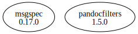

# Third Party Dependencies

<!--[[[fill sbom_sha256()]]]-->
The [SBOM in CycloneDX v1.4 JSON format](https://git.sr.ht/~sthagen/asiakirjasuodatin/blob/default/sbom/cdx.json) with SHA256 checksum ([cb0999e8 ...](https://git.sr.ht/~sthagen/asiakirjasuodatin/blob/default/sbom/cdx.json.sha256 "sha256:cb0999e81e9d7ce079fb58f32c2c6fd20104b9757d28b05358b2b805002e338b")).
<!--[[[end]]] (checksum: f517a807ce3526289a9f13be72e75cb6)-->
## Licenses 

JSON files with complete license info of: [direct dependencies](direct-dependency-licenses.json) | [all dependencies](all-dependency-licenses.json)

### Direct Dependencies

<!--[[[fill direct_dependencies_table()]]]-->
| Name                                                 | Version                                                | License     | Author          | Description (from packaging data)                                                                        |
|:-----------------------------------------------------|:-------------------------------------------------------|:------------|:----------------|:---------------------------------------------------------------------------------------------------------|
| [msgspec](https://jcristharif.com/msgspec/)          | [0.17.0](https://pypi.org/project/msgspec/0.17.0/)     | BSD License | Jim Crist-Harif | A fast serialization and validation library, with builtin support for JSON, MessagePack, YAML, and TOML. |
| [pandocfilters](http://github.com/jgm/pandocfilters) | [1.5.0](https://pypi.org/project/pandocfilters/1.5.0/) | BSD License | John MacFarlane | Utilities for writing pandoc filters in python                                                           |
<!--[[[end]]] (checksum: f5d32acf2fc4a273c8f1a4de420a00d5)-->

### Indirect Dependencies

<!--[[[fill indirect_dependencies_table()]]]-->
| Name | Version | License | Author | Description (from packaging data) |
|:-----|:--------|:--------|:-------|:----------------------------------|
<!--[[[end]]] (checksum: 8a87b89207db0be2864af66f9266660c)-->

## Dependency Tree(s)

JSON file with the complete package dependency tree info of: [the full dependency tree](package-dependency-tree.json)

### Rendered SVG

Base graphviz file in dot format: [Trees of the direct dependencies](package-dependency-tree.dot.txt)



### Console Representation

<!--[[[fill dependency_tree_console_text()]]]-->
````console
msgspec==0.17.0
pandocfilters==1.5.0
````
<!--[[[end]]] (checksum: dc25039813eb50ca86eb08ae4a071c34)-->
